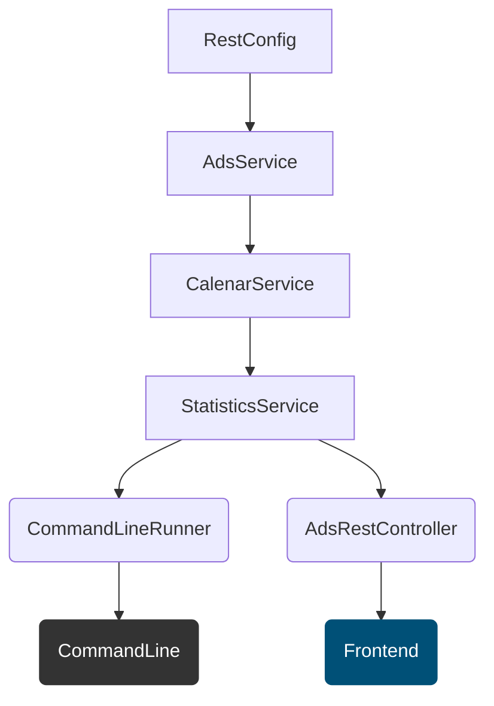

# Ukentlig statistikk (pam-public-feed)

### Oppgave for backend-utviklere:

* Lag en backend som viser antall annonser som inneholder "kotlin" vs "java" pr uke siste halvår.
* Besvares med Kotlin.
* Det er tilstrekkelig at output vises som prettyfied json på kommandolinjen.
* Besvarelsen skal inneholde tester og en README.md som beskriver løsningen.


### Planlegging og fremgangsmåte

| Branch | Hovedoppgaver                 |
|--------|-------------------------------|
| JIRA-1 | Opprette prosjekt i intelliJ  |
| JIRA-2 | Lage modeller                 |
| JIRA-3 | Lage RestClient og tester     |
| JIRA-4 | Lage service og tester        |
| JIRA-5 | Lage parser og tester         |
| JIRA-6 | Lage fun for prettyprint      |
| JIRA-7 | Lage Github Actions og deploy |
| JIRA-8 | Lage frontend nlod.no i Aksel |


### Diagram



### Utviklingsmiljø og forutsetninger

* OpenJDK 21
* Maven

### Kjør tester

```sh
mvn test
```

### Kjør app

```sh
mvn spring-boot:run
```

### Eksempel resultat

```javascript
[
    ...,
    {
        "weekNr": 9,
        "startWeek": "2024-02-26T01:27:33.068+00:00",
        "endWeek": "2024-03-04T01:27:33.068+00:00",
        "year": 2024,
        "kotlinCounter": 1,
        "javaCounter": 3,
        "period": "[2024-02-26,2024-03-04)"
    },
    {
        "weekNr": 10,
        "startWeek": "2024-03-04T01:27:33.068+00:00",
        "endWeek": "2024-03-11T01:27:33.068+00:00",
        "year": 2024,
        "kotlinCounter": 0,
        "javaCounter": 3,
        "period": "[2024-03-04,2024-03-11)"
    },
    {
        "weekNr": 11,
        "startWeek": "2024-03-11T01:27:33.068+00:00",
        "endWeek": "2024-03-18T01:27:33.068+00:00",
        "year": 2024,
        "kotlinCounter": 1,
        "javaCounter": 7,
        "period": "[2024-03-11,2024-03-18)"
    },,
    ... 
]

```