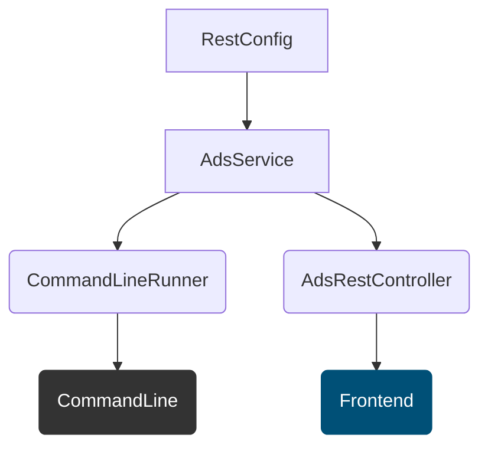

# Ukentlig statistikk (pam-public-feed)

### Oppgave for backend-utviklere:

* Lag en backend som viser antall annonser som inneholder "kotlin" vs "java" pr uke siste halvår.

* Besvares med Kotlin.

* Det er tilstrekkelig at output vises som prettyfied json på kommandolinjen.

* Besvarelsen skal inneholde tester og en README.md som beskriver løsningen din.


### Planlegging og fremgangsmåte

| Branch | Hovedoppgaver                 |
|--------|-------------------------------|
| JIRA-1 | Opprette prosjekt i intelliJ  |
| JIRA-2 | Lage modeller                 |
| JIRA-3 | Lage RestClient og tester     |
| JIRA-4 | Lage service og tester        |
| JIRA-5 | Lage parser og tester         |
| JIRA-6 | Lage fun for prettyprint      |
| JIRA-7 | Lage Github Actions og deploy |
| JIRA-8 | Lage frontend nlod.no i Aksel |


### Diagram utkast



### Utviklingsmiljø og forutsetninger

* OpenJDK 21

* Maven

### Kjør tester

```sh
mvn test
```

### Kjør app

```sh
mvn spring-boot:run
```

### Eksempel resultat


```